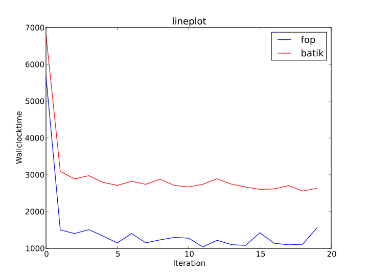
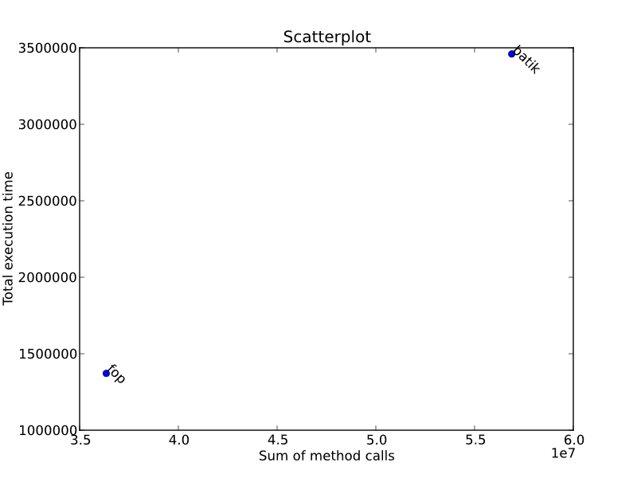

=================
 Example Gallery
=================

Simple Examples
===============

Lineplot
--------

A simple lineplot, which can also be found in :file:`docs/examples/lineplot.job`:

.. literalinclude:: jobs/lineplot.job
    :language: python
    :linenos:
    :encoding: utf8

Barplot
-------

A simple barlot, which can also be found in :file:`docs/examples/barplot.job`:

.. image:: jobs/barplot.png

.. literalinclude:: jobs/barplot.job
    :language: python
    :linenos:
    :encoding: utf8

Scatterplot
-----------

A simple barlot, which can also be found in :file:`docs/examples/scatterplot.job`:

.. literalinclude:: jobs/scatterplot.job
    :language: python
    :linenos:
    :encoding: utf8

More Complex Examples
=====================

Lineplot
--------

A simple lineplot, which can also be found in :file:`docs/examples/lineplot.job`:

.. literalinclude:: jobs/complex_lineplot.job
    :language: python
    :linenos:
    :encoding: utf8

Barplot
-------

A simple barlot, which can also be found in :file:`docs/examples/barplot.job`:

.. literalinclude:: jobs/complex_barplot.job
    :language: python
    :linenos:
    :encoding: utf8

Scatterplot
-----------

.. literalinclude:: jobs/complex_scatterplot.job
    :language: python
    :linenos:
    :encoding: utf8
